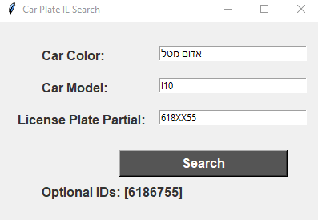

# Car Plate IL Search

This application allows you to search for car license plates in Israel based on color, model, and partial license plate number.

## Usage

### Console App

To use the console app version, follow these steps:

1. Clone the repository.
2. Open a terminal or command prompt.
3. Navigate to the project directory.
4. Run the following command:

    ```bash
    python console_app.py
    ```

5. Enter the car color, model, and partial license plate number when prompted.
6. The console app will display the matching license plate numbers.

### Web Interface

To use the web interface version, follow these steps:

1. Clone the repository.
2. Open a terminal or command prompt.
3. Navigate to the project directory.
4. Run the following command:

    ```bash
    python web_app.py
    ```

5. Open a web browser and visit `http://localhost:5000`.
6. Enter the car color, model, and partial license plate number in the provided input fields.
7. Click the "Search" button.
8. The web interface will display the matching license plate numbers.

## Screenshots

### Console App



### Web Interface


